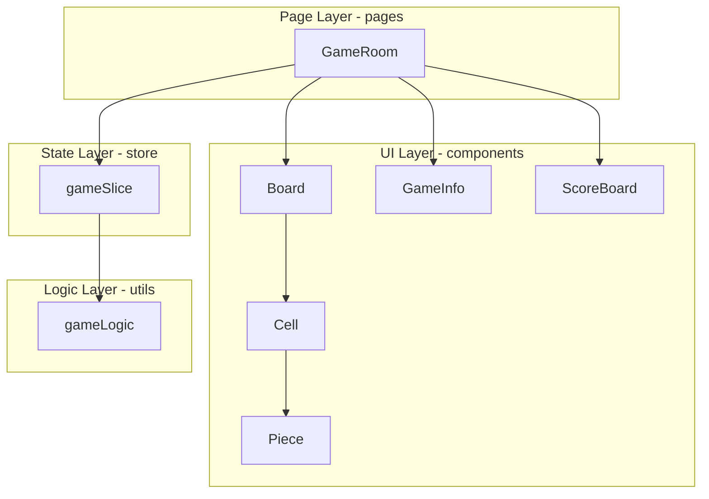
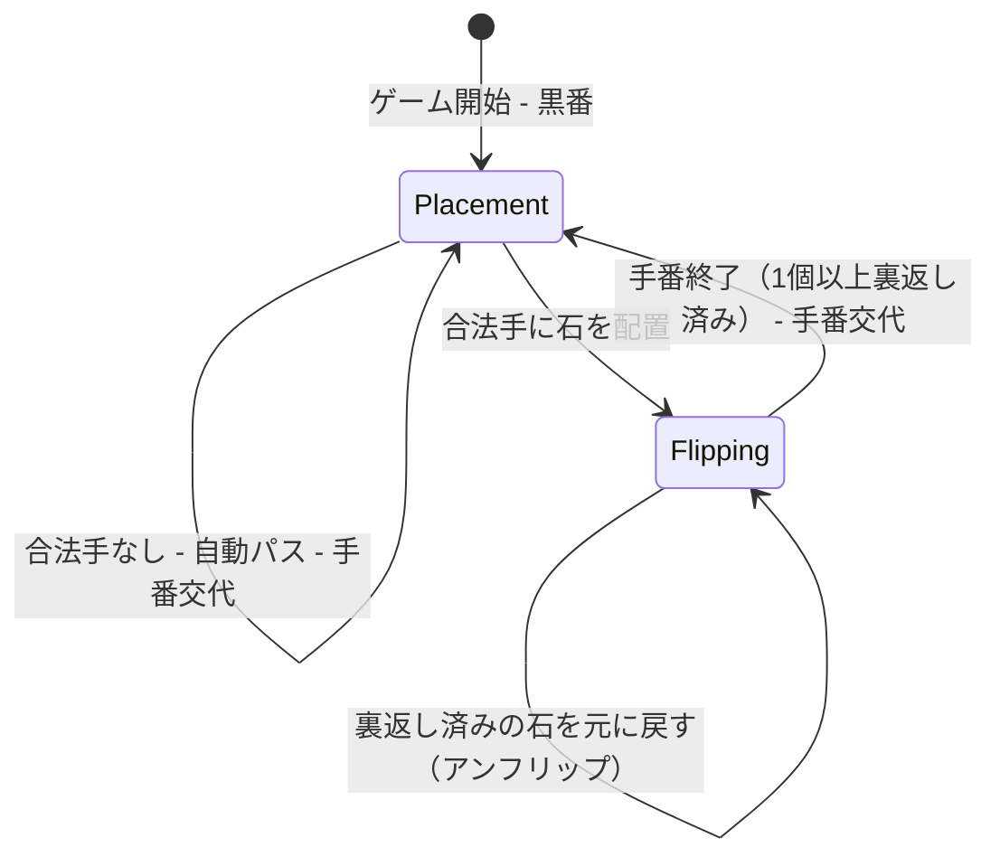
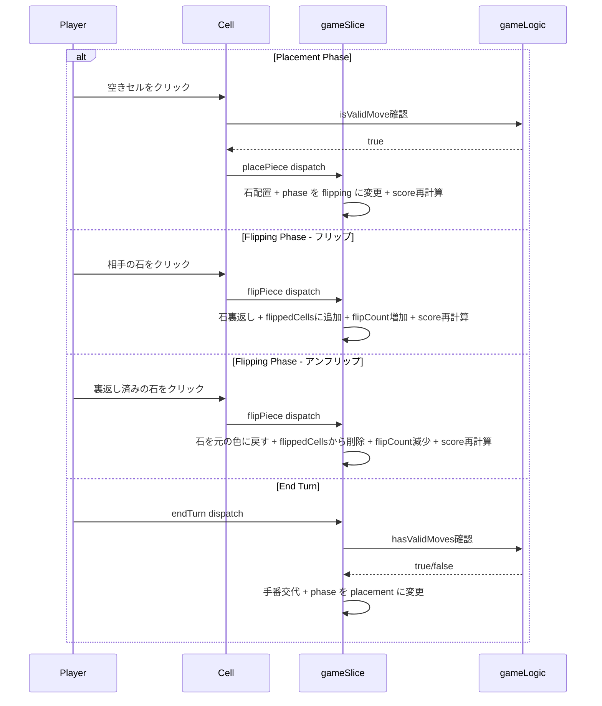
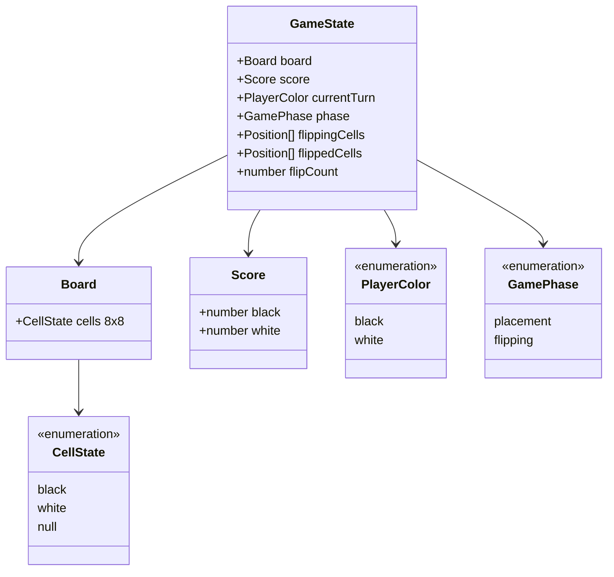

# Design Document: anarchy-reversi-core

## Overview

アナーキーオセロのコアゲーム機能を提供する。8x8のリバーシ盤面上で、標準ルールに基づく石の配置と、制限のない手動裏返し（アナーキー要素）を組み合わせた独自のゲーム体験を実現する。

**Purpose**: ローカル2人対戦（同一デバイス）で、子供が直感的に操作できるリバーシゲームのコア体験を提供する。
**Users**: 子供（およびその家族）が、配置ルールに従いつつ裏返しの自由度を楽しむアナーキーオセロを遊ぶ。
**Impact**: 既存のフロントエンド基盤（Redux store、GameRoomページ、型定義）に新コンポーネントとゲームロジックを追加する。

### Goals
- 8x8リバーシ盤面の視覚的表示とレスポンシブ対応
- 二段階ターンシステム（配置フェーズ + 裏返しフェーズ）の実装
- リアルタイムスコア表示
- ゲームリセット機能

### Non-Goals
- オンライン対戦（WebSocket通信） — 後続フェーズで実装
- ゲーム終了判定・勝敗表示 — 要件範囲外
- サウンドエフェクト — フェーズ2で実装
- 観戦・チャット機能 — フェーズ3で実装
- バックエンド（Go + Redis）実装 — 後続フェーズで実装

## Architecture

> 調査詳細は `research.md` を参照。設計判断は本ドキュメント内で完結させる。

### Existing Architecture Analysis

既存のフロントエンド基盤を拡張する形で設計する。

- **既存パターン**: Redux Toolkit `createSlice` + typed hooks（`useAppSelector`/`useAppDispatch`）
- **既存ドメイン境界**: `pages/` → ページコンポーネント、`store/` → 状態管理、`types/` → 型定義
- **変更が必要な統合ポイント**:
  - `gameSlice.ts`: `toggleCell`を新アクション（`placePiece`/`flipPiece`/`endTurn`）に置き換え、`currentTurn`/`phase`を追加
  - `types/game.ts`: `GameState`に`currentTurn`と`phase`を追加、`PlayerColor`/`GamePhase`/`Position`型を追加
  - `GameRoom.tsx`: ボードプレースホルダーを`Board`コンポーネントに置き換え、サイドバーを更新

### Architecture Pattern & Boundary Map

**Architecture Integration**:
- Selected pattern: Component-based SPA + Redux Toolkit（既存パターンの拡張）
- Domain/feature boundaries: UI Layer（表示コンポーネント）、State Layer（Redux store）、Logic Layer（ゲームロジックユーティリティ）
- Existing patterns preserved: `createSlice`、typed hooks、PascalCase命名、Tailwind CSS
- New components rationale: ゲーム盤面の描画・操作にBoard/Cell/Pieceが必要、ターン表示・制御にGameInfoが必要
- Steering compliance: Redux Toolkit採用（tech.md）、コンポーネント分離（structure.md）



### Technology Stack

| Layer | Choice / Version | Role in Feature | Notes |
|-------|------------------|-----------------|-------|
| Frontend | React 19.2 + TypeScript 5.9 | UIコンポーネント描画 | 既存、変更なし |
| State Management | Redux Toolkit 2.11 | ゲーム状態管理 | 既存、拡張（新アクション追加） |
| Styling | Tailwind CSS 4.1 | レスポンシブ盤面UI | 既存、変更なし |
| Build | Vite 7.2 | 開発サーバー・ビルド | 既存、変更なし |

## System Flows

### ゲームターンの状態遷移



**Key Decisions**:
- 配置フェーズでは標準リバーシの挟み判定で合法手を決定
- 裏返しフェーズでは回数・対象の制限なし（アナーキー要素）
- 裏返し済みの石を再クリックすると元の色に戻せる（アンフリップ）
- 「手番終了」ボタンは裏返しフェーズかつ1個以上の石を裏返した場合のみ有効化
- 合法手がない場合は自動パスし、相手の配置フェーズへ遷移
- 両プレイヤーとも合法手がない場合、パスを1回実行し手番を切り替えた状態で停止（ループ防止）
- 手番終了は明示的なボタン操作が必要

### セルクリック処理フロー



## Requirements Traceability

| Requirement | Summary | Components | Interfaces | Flows |
|-------------|---------|------------|------------|-------|
| 1.1 | 8x8グリッド表示 | Board, Cell | BoardProps | - |
| 1.2 | 黒石・白石・空の視覚区別 | Cell, Piece | CellProps, PieceProps | - |
| 1.3 | 初期配置（中央4マス） | gameSlice, gameLogic | createInitialBoard | ゲーム開始 |
| 1.4 | レスポンシブ盤面表示 | Board | BoardProps | - |
| 1.5 | 子供向けタッチターゲット | Cell | CellProps | - |
| 2.1 | 手番表示 | GameInfo | GameInfoProps | - |
| 2.2 | 黒番から開始 | gameSlice | GameState | ゲーム開始 |
| 2.3 | 合法手判定 | gameLogic | getValidMoves | 配置フェーズ |
| 2.4 | 合法手の視覚表示 | Cell | CellProps.isValidMove | 配置フェーズ |
| 2.5 | 石の配置 | gameSlice | placePiece | 配置フェーズ |
| 2.6 | 裏返しフェーズ遷移 | gameSlice | GameState.phase | ターン遷移 |
| 2.7 | 手動裏返し | gameSlice | flipPiece | 裏返しフェーズ |
| 2.8 | アンフリップ（裏返し済みの石を元に戻す） | gameSlice, Board, Cell | flipPiece, flippedCells | 裏返しフェーズ |
| 2.9 | 裏返し無制限 | gameSlice | - | 裏返しフェーズ |
| 2.10 | 手番終了ボタン活性化（flipCount >= 1） | GameInfo | GameInfoProps.flipCount | ターン遷移 |
| 2.11 | 手番終了ボタン非活性（flipCount == 0） | GameInfo | GameInfoProps.flipCount | ターン遷移 |
| 2.12 | 手番終了ボタン | GameInfo | GameInfoProps.onEndTurn | ターン遷移 |
| 2.13 | 自動パス | gameSlice, gameLogic | hasValidMoves | ターン遷移 |
| 2.14 | 操作時の視覚フィードバック | Cell | CellProps | - |
| 3.1 | スコア常時表示 | ScoreBoard | ScoreBoardProps | - |
| 3.2 | スコア即時更新 | gameSlice | calculateScore | - |
| 3.3 | スコア視覚区別 | ScoreBoard | ScoreBoardProps | - |
| 4.1 | 盤面リセット | gameSlice | resetGame | ゲームリセット |
| 4.2 | スコアリセット | gameSlice | resetGame | ゲームリセット |
| 4.3 | 手番リセット | gameSlice | resetGame | ゲームリセット |

## Components and Interfaces

| Component | Domain/Layer | Intent | Req Coverage | Key Dependencies | Contracts |
|-----------|-------------|--------|--------------|------------------|-----------|
| Board | UI / components | 8x8グリッド盤面の描画 | 1.1, 1.4, 1.5 | Cell (P0) | State |
| Cell | UI / components | 個別セルの描画と操作受付 | 1.2, 1.5, 2.4, 2.5, 2.7, 2.11 | Piece (P1) | - |
| Piece | UI / components | 石の視覚表示 | 1.2 | - | - |
| GameInfo | UI / components | 手番・フェーズ表示と手番終了操作 | 2.1, 2.9 | gameSlice (P0) | State |
| ScoreBoard | UI / components | スコア表示 | 3.1, 3.2, 3.3 | gameSlice (P0) | State |
| gameSlice | State / store | ゲーム状態の管理と状態遷移 | All | gameLogic (P0) | Service, State |
| gameLogic | Logic / utils | 合法手判定の純粋関数群 | 2.3, 2.10 | - | Service |

### UI Layer

#### Board

| Field | Detail |
|-------|--------|
| Intent | 8x8グリッド形式でゲーム盤面を描画し、セルクリックイベントを子コンポーネントに伝播する |
| Requirements | 1.1, 1.4, 1.5 |

**Responsibilities & Constraints**
- 8x8のCSS Gridレイアウトで盤面を構成
- ボード全体のレスポンシブサイズ調整（`max-w-2xl`、アスペクト比維持）
- 各セルの状態に応じてCellコンポーネントを描画
- 合法手・裏返し可能セルの判定結果を各Cellに伝達

**Dependencies**
- Inbound: GameRoom — ボードの配置先ページ (P0)
- Outbound: Cell — 各セルの描画 (P0)

**Contracts**: State [x]

##### State Management

```typescript
interface BoardProps {
  board: Board;
  validMoves: Position[];
  phase: GamePhase;
  currentTurn: PlayerColor;
  flippingCells: Position[];
  flippedCells: Position[];
  onCellClick: (row: number, col: number) => void;
  onFlipEnd: (row: number, col: number) => void;
}
```

**Implementation Notes**
- `validMoves`と`phase`から各セルの`isValidMove`をBoard内で計算してCellに渡す
- `flippedCells`と`phase`から各セルのアンフリップ可能判定（`isFlippable`）を計算してCellに渡す
- `flippingCells`はアニメーション表示用（アニメーション完了後に`clearFlipping`でクリア）
- `flippedCells`はロジック用（ターン中の裏返し済みセル追跡、手番終了までクリアされない）
- Tailwind CSSの`grid grid-cols-8`で8列グリッドを構成
- 既存GameRoomの`aspect-square max-w-2xl mx-auto`コンテナ内に配置

#### Cell

| Field | Detail |
|-------|--------|
| Intent | 個別のセルを描画し、状態に応じた視覚表示とクリック操作を提供する |
| Requirements | 1.2, 1.5, 2.4, 2.5, 2.7, 2.11 |

**Responsibilities & Constraints**
- セル状態（黒石・白石・空）に応じた背景・石の表示
- 配置可能な位置のハイライト表示（半透明インジケータ）
- 裏返し可能な石のインタラクション表示（ホバー/タップ時のフィードバック）
- 最低44x44pxのタッチターゲットを確保
- クリックイベントの親への伝播

**Dependencies**
- Inbound: Board — セル描画の親 (P0)
- Outbound: Piece — 石の描画 (P1)

**Contracts**: なし（Presentational component）

```typescript
interface CellProps {
  state: CellState;
  isValidMove: boolean;
  isFlippable: boolean;
  onClick: () => void;
}
```

**Implementation Notes**
- `isValidMove`がtrueの場合、半透明の石またはドットでインジケータ表示
- `isFlippable`がtrueの場合、ホバー時にカーソル変更やハイライトで裏返し可能であることを示す（相手の石の裏返しと裏返し済みの石のアンフリップの両方を含む）
- 無効な操作（配置フェーズで合法手でない位置、裏返しフェーズで空きセルなど）のクリックは`onClick`を呼ばない

#### Piece

| Field | Detail |
|-------|--------|
| Intent | 黒石・白石を視覚的に表示するPresentationalコンポーネント |
| Requirements | 1.2 |

**Implementation Notes**
- 色に応じた円形の石を表示。Tailwind CSSの`rounded-full`で実現
- Boardのセルサイズに対して適切なマージンを持つサイズで描画

```typescript
interface PieceProps {
  color: PlayerColor;
}
```

#### GameInfo

| Field | Detail |
|-------|--------|
| Intent | 現在の手番とゲームフェーズを表示し、手番終了操作を提供する |
| Requirements | 2.1, 2.9 |

**Responsibilities & Constraints**
- 現在の手番（黒番・白番）を色付きインジケータで表示
- 現在のフェーズ（「配置中」「裏返し中」）をテキストで表示
- 「手番終了」ボタンは裏返しフェーズ中かつ`flipCount >= 1`の場合のみ有効化

**Dependencies**
- Inbound: GameRoom — 表示の親 (P0)

**Contracts**: State [x]

```typescript
interface GameInfoProps {
  currentTurn: PlayerColor;
  phase: GamePhase;
  flipCount: number;
  onEndTurn: () => void;
}
```

#### ScoreBoard

| Field | Detail |
|-------|--------|
| Intent | 黒石と白石の数をスコアとして視覚的に区別して表示する |
| Requirements | 3.1, 3.2, 3.3 |

**Responsibilities & Constraints**
- 黒石・白石の数を視覚的に区別して表示
- 盤面変更時に即座に更新（Redux stateの変更に連動）

**Dependencies**
- Inbound: GameRoom — 表示の親 (P0)

**Contracts**: State [x]

```typescript
interface ScoreBoardProps {
  blackCount: number;
  whiteCount: number;
  currentTurn: PlayerColor;
}
```

**Implementation Notes**
- 既存GameRoomのスコア表示セクションの構造を踏襲し、コンポーネントとして分離

### State Layer

#### gameSlice

| Field | Detail |
|-------|--------|
| Intent | ゲームの全状態（盤面、手番、フェーズ、スコア）を管理し、各アクションに応じた状態遷移を実行する |
| Requirements | 1.3, 2.1, 2.2, 2.3, 2.5, 2.6, 2.7, 2.8, 2.9, 2.10, 3.2, 4.1, 4.2, 4.3 |

**Responsibilities & Constraints**
- 盤面状態、手番、フェーズ、スコアの一元管理
- `placePiece`: 指定位置に手番の色の石を配置し、フェーズを`flipping`に遷移
- `flipPiece`: 指定位置の相手の石を手番の色に変更、または裏返し済みの石を元の色に戻す（アンフリップ）
- `endTurn`: 手番を切り替え、次の手番に合法手がない場合は自動パス
- `resetGame`: 全状態を初期状態（中央4マス配置、黒番、配置フェーズ）にリセット
- 各アクション後にスコアを自動再計算

**Dependencies**
- Outbound: gameLogic — 合法手判定、初期盤面生成 (P0)

**Contracts**: Service [x] / State [x]

##### Service Interface

```typescript
// Redux Toolkit createSlice reducers
interface GameSliceReducers {
  placePiece(state: GameState, action: PayloadAction<Position>): void;
  flipPiece(state: GameState, action: PayloadAction<Position>): void;
  endTurn(state: GameState): void;
  resetGame(state: GameState): void;
  updateBoard(state: GameState, action: PayloadAction<Board>): void;
  setRoom(state: GameState, action: PayloadAction<{ roomId: string; playerId: string }>): void;
  setConnected(state: GameState, action: PayloadAction<boolean>): void;
  leaveRoom(state: GameState): void;
}
```

- Preconditions (placePiece): `phase === 'placement'`、指定位置が`getValidMoves`の結果に含まれる
- Preconditions (flipPiece): `phase === 'flipping'`、指定位置に相手の色の石がある、または`flippedCells`に含まれる裏返し済みの石
- Preconditions (endTurn): `phase === 'flipping'`、`flipCount >= 1`
- Postconditions (placePiece): 石が配置、`phase`が`'flipping'`に変更、スコア再計算
- Postconditions (flipPiece - フリップ): 石が裏返し、`flippedCells`に追加、`flipCount`増加、スコア再計算
- Postconditions (flipPiece - アンフリップ): 石が元の色に戻り、`flippedCells`から削除、`flipCount`減少、スコア再計算
- Postconditions (endTurn): `currentTurn`が切り替わり、`phase`が`'placement'`に変更、`flippedCells`/`flippingCells`クリア、`flipCount`リセット。次の手番に合法手がなく、元の手番に合法手がある場合、再度`currentTurn`を切り替え（自動パス）
- Postconditions (resetGame): 初期盤面（中央4マス配置）、黒番、`placement`フェーズ、初期スコア、`flippedCells`/`flippingCells`空、`flipCount`=0
- Invariants: スコアは常に盤面から正確に導出される

##### State Management

```typescript
type PlayerColor = 'black' | 'white';
type GamePhase = 'placement' | 'flipping';

interface Position {
  row: number;
  col: number;
}

interface GameState {
  board: Board;
  score: { black: number; white: number };
  currentTurn: PlayerColor;
  phase: GamePhase;
  flippingCells: Position[];   // アニメーション表示用（完了後にクリア）
  flippedCells: Position[];    // ターン中の裏返し済みセル追跡用（手番終了までクリアされない）
  flipCount: number;           // 裏返し回数（手番終了ボタンの活性化判定に使用）
  roomId: string | null;
  playerId: string | null;
  isConnected: boolean;
}
```

- Persistence: Redux store（メモリ内、ブラウザリロードで消失）
- Consistency: 単一のRedux storeで一貫性を保証
- Concurrency: 単一スレッド（ブラウザ）、同期的dispatch

### Logic Layer

#### gameLogic

| Field | Detail |
|-------|--------|
| Intent | 標準リバーシの合法手判定ロジックを純粋関数として提供する |
| Requirements | 2.3, 2.10 |

**Responsibilities & Constraints**
- 8方向走査による挟み判定
- 盤面とプレイヤー色を入力として合法手リストを返却
- 純粋関数（副作用なし、入力を変更しない）
- 初期盤面の生成（中央4マス配置）

**Dependencies**
- External: なし（自己完結型ユーティリティ）

**Contracts**: Service [x]

##### Service Interface

```typescript
/** 指定プレイヤーの合法手（配置可能な位置）を全て返す */
function getValidMoves(board: Board, player: PlayerColor): Position[];

/** 指定位置が指定プレイヤーにとって合法手かどうかを判定する */
function isValidMove(
  board: Board,
  row: number,
  col: number,
  player: PlayerColor
): boolean;

/** 指定プレイヤーに1つ以上の合法手があるかどうかを判定する */
function hasValidMoves(board: Board, player: PlayerColor): boolean;

/** 中央4マスに初期配置した8x8盤面を生成する */
function createInitialBoard(): Board;

/** 盤面上の黒石・白石の数をカウントする */
function calculateScore(board: Board): { black: number; white: number };
```

- Preconditions: `board`は8x8の二次元配列、`player`は`'black'`または`'white'`
- Postconditions: `getValidMoves`は合法手の`Position`配列を返す（空配列の場合あり）
- Invariants: 入力`board`を変更しない（イミュータブル）

## Data Models

### Domain Model



**Business Rules & Invariants**:
- 盤面は常に8行8列
- `CellState`は`'black'`、`'white'`、`null`の3値のみ
- `currentTurn`は`'black'`または`'white'`
- `phase`はゲーム開始時に`'placement'`、石の配置後に`'flipping'`に遷移
- スコアは`board`から一意に導出される（`score.black` = 盤面上の黒石数、`score.white` = 白石数）
- 初期盤面: `board[3][3] = 'white'`, `board[3][4] = 'black'`, `board[4][3] = 'black'`, `board[4][4] = 'white'`、その他`null`

### Logical Data Model

**GameState構造**:
- `board`: 8x8の`CellState[][]`。行が外側配列、列が内側配列（`board[row][col]`でアクセス）
- `score`: `board`から`calculateScore`関数で計算される派生データ。Reduxの各reducer内で盤面変更後に再計算
- `currentTurn`: 現在の手番プレイヤー。`endTurn`アクション時に切り替え
- `phase`: 現在のゲームフェーズ。`placePiece`で`'flipping'`に、`endTurn`で`'placement'`に遷移

**初期状態**:

| Field | Value |
|-------|-------|
| board | 中央4マス配置、その他null |
| score | `{ black: 2, white: 2 }` |
| currentTurn | `'black'` |
| phase | `'placement'` |
| flippingCells | `[]` |
| flippedCells | `[]` |
| flipCount | `0` |
| roomId | `null` |
| playerId | `null` |
| isConnected | `false` |

## Error Handling

### Error Strategy

ローカル2人対戦MVPのため、ネットワークエラーやサーバーエラーは対象外。UIレベルのバリデーションのみ。

### Error Categories and Responses

**User Errors（UIバリデーション）**:
- 配置フェーズで合法手でない位置をクリック → 操作を無視（`onClick`を発火しない）
- 裏返しフェーズで空きセルまたは配置した自分の石をクリック → 操作を無視（裏返し済みの石はアンフリップ対象のため操作可能）
- 配置フェーズで「手番終了」ボタンをクリック → ボタンを無効化（`disabled`属性）
- 裏返しフェーズで裏返し回数が0の時に「手番終了」ボタンをクリック → ボタンを無効化（`disabled`属性）

**Design Principle**: 子供向けUIのため、エラーメッセージは表示しない。無効な操作は静かに無視し、合法手のハイライト表示で正しい操作を誘導する。

## Testing Strategy

### Unit Tests: gameLogic
- `getValidMoves`: 初期盤面で黒番の合法手が正しい4箇所を返すことを確認
- `getValidMoves`: 盤面の端・角付近のケースで正しく判定されることを確認
- `isValidMove`: 合法手と非合法手の判定が正しいことを確認
- `hasValidMoves`: 合法手がない盤面で`false`を返すことを確認
- `createInitialBoard`: 中央4マスが正しく配置されることを確認
- `calculateScore`: 各種盤面状態で正しいスコアを返すことを確認

### Unit Tests: gameSlice
- `placePiece`: 合法手に石が配置され、フェーズが`flipping`に遷移することを確認
- `flipPiece`: 相手の石が裏返され、スコアが更新されることを確認
- `endTurn`: 手番が切り替わり、フェーズが`placement`に遷移することを確認
- `endTurn`: 次の手番に合法手がない場合、自動パスされることを確認
- `resetGame`: 全状態が初期状態にリセットされることを確認

### Component Tests: React Testing Library
- Board: 8x8（64個）のセルが描画されることを確認
- Cell: 各状態（黒・白・空・合法手ハイライト）の視覚表示を確認
- Cell: クリックイベントが正しくハンドラーに伝播されることを確認
- GameInfo: 手番表示と「手番終了」ボタンの有効化/無効化を確認
- ScoreBoard: スコア表示が正しいことを確認
