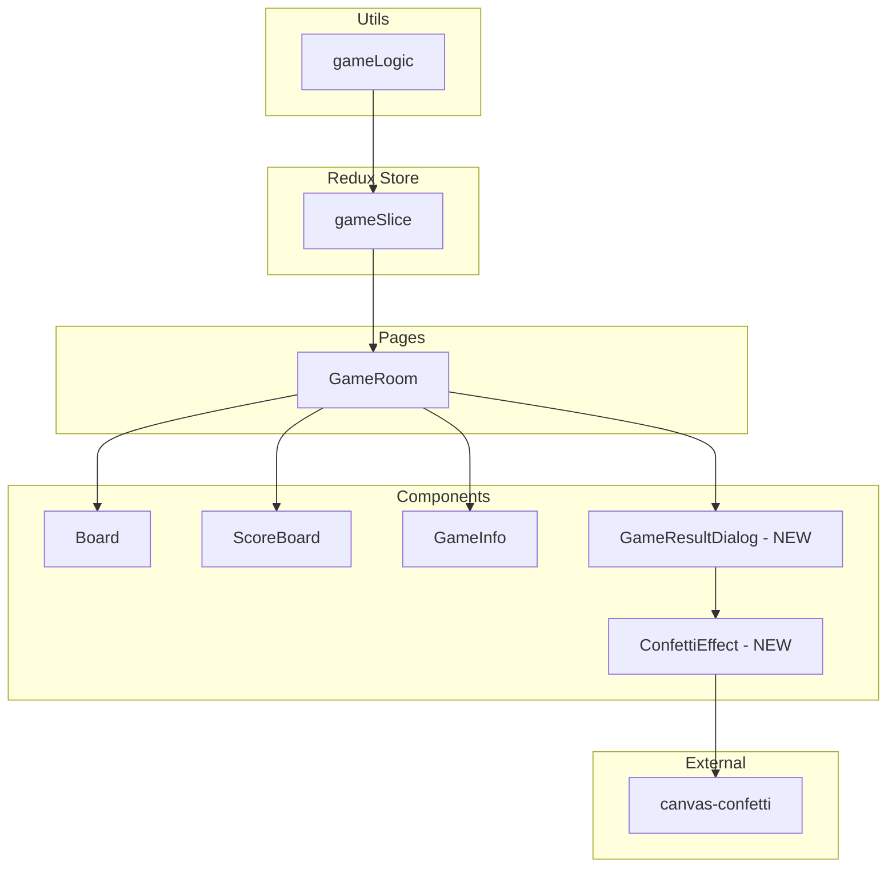
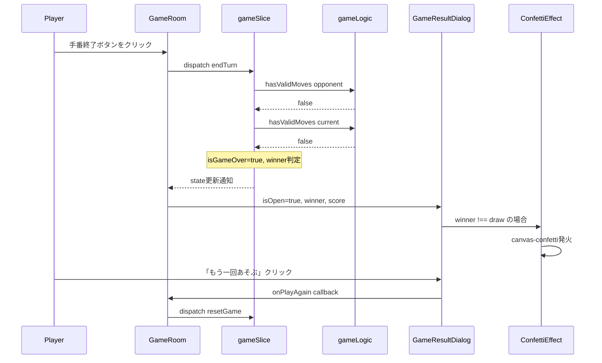
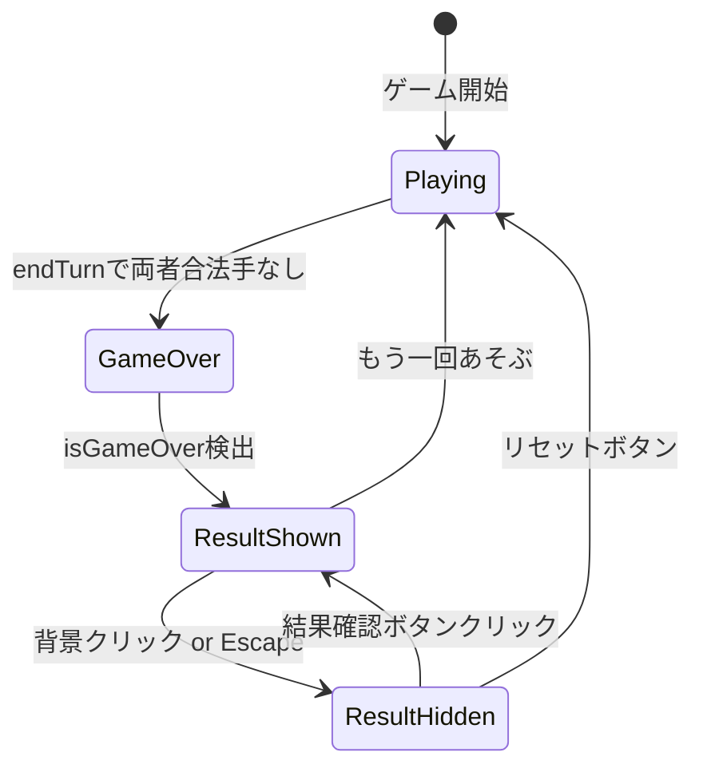

# Design Document: ゲーム結果表示機能

## Overview

**Purpose**: ゲーム終了時に勝敗結果をわかりやすく表示し、クラッカー🎉アニメーションで勝者を称える機能を提供する。
**Users**: ローカル2人対戦のプレイヤー（子供を主な対象）がゲーム完了後に勝敗を確認し、次のゲームに進む。
**Impact**: 既存の`gameSlice`にゲーム終了状態を追加し、結果表示UIコンポーネントを新規作成する。

### Goals
- 両プレイヤーに合法手がなくなった時点でゲーム終了を自動検出し、操作をロックする
- 勝敗結果をモーダルで表示し、クラッカーアニメーションで勝者を視覚的に称える
- 「もう一回あそぶ」による再プレイフローを提供する
- 全要件でアクセシビリティ（キーボード操作、ARIA、スクリーンリーダー）に対応する

### Non-Goals
- オンライン対戦時の結果表示・同期（将来フェーズ）
- 戦績の保存・履歴機能
- カスタムアニメーションの設定UI

## Architecture

### Existing Architecture Analysis

現在のアーキテクチャ:
- **状態管理**: Redux Toolkit（`gameSlice`）でゲーム全状態を管理
- **コンポーネント階層**: `GameRoom` → `Board`, `ScoreBoard`, `GameInfo`
- **prop伝搬チェーン**: `GameRoom`がRedux storeから読み取り、子コンポーネントにpropsで配布
- **既存モーダルパターン**: `GameRoom`内の「遊び方」ダイアログ（`showHowToPlay` state）

変更が必要な箇所:
- `GameState`型にゲーム終了フィールドを追加
- `endTurn`リデューサーにゲーム終了判定ロジックを追加
- `placePiece`/`flipPiece`リデューサーにゲーム終了ガードを追加
- `GameRoom`に結果ダイアログの表示制御を追加

### Architecture Pattern & Boundary Map



**Architecture Integration**:
- **Selected Pattern**: 既存のRedux + コンポーネント階層パターンを踏襲
- **新コンポーネント**: `GameResultDialog`（結果モーダル）と`ConfettiEffect`（アニメーション）を追加
- **既存パターン**: `GameRoom`内のモーダル管理パターン（`showHowToPlay`と同様の`showResult` state）
- **steering準拠**: アニメーション状態とロジック状態の分離原則に従い、confettiはUIエフェクトとしてRedux外で管理

### Technology Stack

| Layer | Choice / Version | Role in Feature | Notes |
|-------|------------------|-----------------|-------|
| Frontend | React 19 + TypeScript | 結果表示UI、状態管理 | 既存 |
| State | Redux Toolkit | ゲーム終了状態管理 | `gameSlice`拡張 |
| Animation | canvas-confetti ^1.9 | クラッカーパーティクルアニメーション | 新規依存 |
| Type Definitions | @types/canvas-confetti | TypeScript型定義 | devDependency |
| Styling | Tailwind CSS v4 | 結果画面のスタイリング | 既存 |

## System Flows

### ゲーム終了〜結果表示フロー



### 結果ダイアログ状態遷移



## Requirements Traceability

| Requirement | Summary | Components | Interfaces | Flows |
|-------------|---------|------------|------------|-------|
| 1.1 | 両者合法手なしで終了遷移 | gameSlice | endTurn reducer | ゲーム終了フロー |
| 1.2 | スコア比較で勝者判定 | gameSlice, gameLogic | endTurn reducer | ゲーム終了フロー |
| 1.3 | 同数は引き分け判定 | gameSlice | endTurn reducer | ゲーム終了フロー |
| 1.4 | 終了中は操作拒否 | gameSlice | placePiece, flipPiece reducers | — |
| 2.1 | 結果画面モーダル表示 | GameResultDialog, GameRoom | GameResultDialogProps | 結果表示フロー |
| 2.2 | 勝者色または引き分け表示 | GameResultDialog | GameResultDialogProps | — |
| 2.3 | 最終スコア表示 | GameResultDialog | GameResultDialogProps | — |
| 2.4 | 子供向けの視覚表現 | GameResultDialog | — | — |
| 2.5 | クラッカーアニメーション | ConfettiEffect | ConfettiEffectProps | 結果表示フロー |
| 2.6 | 引き分け時アニメーションなし | ConfettiEffect | ConfettiEffectProps | — |
| 3.1 | もう一回あそぶボタン | GameResultDialog | GameResultDialogProps | 結果表示フロー |
| 3.2 | リセットして新ゲーム開始 | GameRoom, gameSlice | onPlayAgain callback | 結果表示フロー |
| 3.3 | 背景クリックで閉じる | GameResultDialog | onClose callback | ダイアログ状態遷移 |
| 3.4 | 結果再確認手段 | GameRoom, GameInfo | — | ダイアログ状態遷移 |
| 4.1 | 手番表示の切り替え | GameInfo | GameInfoProps拡張 | — |
| 4.2 | 手番終了ボタン非活性 | GameInfo | GameInfoProps拡張 | — |
| 4.3 | スコアボード勝者ハイライト | ScoreBoard | ScoreBoardProps拡張 | — |
| 5.1 | フォーカス移動 | GameResultDialog | — | — |
| 5.2 | キーボード操作 | GameResultDialog | — | — |
| 5.3 | ARIA属性 | GameResultDialog | — | — |
| 5.4 | スクリーンリーダー通知 | GameResultDialog | aria-live | — |

## Components and Interfaces

| Component | Domain/Layer | Intent | Req Coverage | Key Dependencies | Contracts |
|-----------|-------------|--------|--------------|-----------------|-----------|
| gameSlice拡張 | Store | ゲーム終了判定・状態管理 | 1.1-1.4 | gameLogic (P0) | State |
| GameState型拡張 | Types | 終了状態の型定義 | 1.1-1.3 | — | State |
| GameResultDialog | UI | 結果モーダル表示 | 2.1-2.4, 3.1, 3.3, 5.1-5.4 | ConfettiEffect (P1) | State |
| ConfettiEffect | UI | クラッカーアニメーション | 2.5, 2.6 | canvas-confetti (P0) | — |
| GameRoom拡張 | Pages | 結果ダイアログ制御 | 3.2, 3.4 | GameResultDialog (P0) | — |
| GameInfo拡張 | UI | 終了時UI更新 | 4.1, 4.2 | — | — |
| ScoreBoard拡張 | UI | 勝者ハイライト | 4.3 | — | — |

### Store Layer

#### gameSlice拡張

| Field | Detail |
|-------|--------|
| Intent | `endTurn`内でゲーム終了を検出し、`isGameOver`と`winner`をstateに設定する |
| Requirements | 1.1, 1.2, 1.3, 1.4 |

**Responsibilities & Constraints**
- `endTurn`リデューサー内で両プレイヤーの`hasValidMoves`がfalseの場合、`isGameOver: true`を設定
- `winner`をスコア比較で決定（black > white → `'black'`、white > black → `'white'`、同数 → `'draw'`）
- `placePiece`と`flipPiece`の先頭で`isGameOver`チェックを追加し、trueの場合は早期リターン
- `resetGame`で`isGameOver: false`、`winner: null`に初期化

**Dependencies**
- Inbound: GameRoom — dispatch元 (P0)
- Outbound: gameLogic — `hasValidMoves`呼び出し (P0)

**Contracts**: State [x]

##### State Management

新規フィールド:

```typescript
// types/game.ts に追加
export type GameResult = PlayerColor | 'draw';

export interface GameState {
  // ... existing fields ...
  isGameOver: boolean;
  winner: GameResult | null;
}
```

初期値:
```typescript
const initialState: GameState = {
  // ... existing fields ...
  isGameOver: false,
  winner: null,
};
```

`endTurn`リデューサーの拡張ロジック:
```typescript
// 既存の手番切り替えロジックの後に追加
if (!hasValidMoves(state.board, 'black') && !hasValidMoves(state.board, 'white')) {
  state.isGameOver = true;
  const { black, white } = state.score;
  state.winner = black > white ? 'black' : white > black ? 'white' : 'draw';
}
```

操作ガード:
```typescript
// placePiece, flipPiece の先頭
if (state.isGameOver) return;
```

**Implementation Notes**
- `resetGame`既存リデューサーでinitialStateへの代入により新フィールドも自動リセットされる
- `endTurn`内の判定タイミングは手番切り替え・自動パス処理の後、フェーズリセットの前

### Types Layer

#### GameState型拡張

| Field | Detail |
|-------|--------|
| Intent | ゲーム終了状態と勝者情報を型安全に表現する |
| Requirements | 1.1, 1.2, 1.3 |

**Contracts**: State [x]

```typescript
// types/game.ts
export type GameResult = PlayerColor | 'draw';

export interface GameState {
  board: Board;
  score: { black: number; white: number };
  currentTurn: PlayerColor;
  phase: GamePhase;
  flippingCells: Position[];
  flippedCells: Position[];
  flipCount: number;
  roomId: string | null;
  playerId: string | null;
  isConnected: boolean;
  isGameOver: boolean;        // NEW
  winner: GameResult | null;  // NEW
}
```

### UI Layer — New Components

#### GameResultDialog

| Field | Detail |
|-------|--------|
| Intent | ゲーム終了時に勝敗結果をモーダル形式で表示し、再プレイ操作を提供する |
| Requirements | 2.1, 2.2, 2.3, 2.4, 3.1, 3.3, 5.1, 5.2, 5.3, 5.4 |

**Responsibilities & Constraints**
- モーダルオーバーレイとして結果を表示
- 勝者の色、最終スコアを表示
- 「もう一回あそぶ」ボタンを提供
- 背景クリック・Escapeキーでモーダルを閉じる
- 開いた時にフォーカスをモーダル内に移動
- `role="dialog"`, `aria-modal="true"`, `aria-label`を設定
- `aria-live="assertive"`で結果をスクリーンリーダーに通知

**Dependencies**
- Inbound: GameRoom — props経由で表示制御 (P0)
- Outbound: ConfettiEffect — 勝者確定時にアニメーション発火 (P1)

**Contracts**: State [x]

##### Props Interface

```typescript
interface GameResultDialogProps {
  isOpen: boolean;
  winner: GameResult | null;
  score: { black: number; white: number };
  onPlayAgain: () => void;
  onClose: () => void;
}
```

- `isOpen`: モーダルの表示/非表示
- `winner`: `'black'` | `'white'` | `'draw'` | `null`
- `score`: 最終スコア
- `onPlayAgain`: 「もう一回あそぶ」ボタンのコールバック（リセット + モーダル閉じ）
- `onClose`: 背景クリック・Escapeキーのコールバック（モーダル閉じのみ）

**Implementation Notes**
- 既存「遊び方」モーダルのDOM構造・スタイリングパターンを踏襲
- 子供向け: 大きなフォントサイズ（`text-3xl`以上）、色付きの勝者表示、楽しいメッセージ
- 勝者表示: 黒勝ち→「くろのかち！」、白勝ち→「しろのかち！」、引き分け→「ひきわけ！」
- フォーカストラップ: `useEffect`でモーダル表示時にフォーカスを移動、Escapeキーリスナー登録
- `aria-live="assertive"`のスクリーンリーダー通知用の非表示要素を含む

#### ConfettiEffect

| Field | Detail |
|-------|--------|
| Intent | 勝者決定時にクラッカーパーティクルアニメーションを画面全体に表示する |
| Requirements | 2.5, 2.6 |

**Responsibilities & Constraints**
- `winner`が`'black'`または`'white'`の場合のみアニメーションを発火
- `winner`が`'draw'`または`null`の場合はアニメーションを発火しない
- `prefers-reduced-motion`設定を尊重する（`disableForReducedMotion: true`）
- アニメーションは一度だけ発火し、ループしない

**Dependencies**
- Inbound: GameResultDialog — 表示時に発火指示 (P0)
- External: canvas-confetti — アニメーションエンジン (P0)

**Contracts**: — (副作用のみ、状態管理なし)

##### Props Interface

```typescript
interface ConfettiEffectProps {
  active: boolean;
}
```

- `active`: `true`でアニメーション発火。`winner !== 'draw' && winner !== null`の条件で親が制御

**Implementation Notes**
- `useEffect`内で`canvas-confetti`の`confetti()`を呼び出し
- 発火パターン: 左右からのクラッカー射出（`angle: 60` + `angle: 120`, `origin`を左右に設定）
- `confetti({ particleCount: 100, spread: 70, origin: { x: 0.1, y: 0.6 }, angle: 60, disableForReducedMotion: true })`
- `confetti({ particleCount: 100, spread: 70, origin: { x: 0.9, y: 0.6 }, angle: 120, disableForReducedMotion: true })`
- `active`が`false`→`true`に変わった時のみ発火（`useRef`で前回値を追跡）

### UI Layer — Existing Component Extensions

#### GameRoom拡張

| Field | Detail |
|-------|--------|
| Intent | ゲーム終了状態を監視し、結果ダイアログの表示/非表示を制御する |
| Requirements | 3.2, 3.4 |

**Responsibilities & Constraints**
- Redux storeから`isGameOver`と`winner`を読み取る
- `showResult`ローカルstateでモーダルの表示/非表示を管理
- `isGameOver`が`true`に変わったら`showResult`を`true`に設定（`useEffect`）
- `onPlayAgain`: `resetGame`をdispatchし、`showResult`を`false`に設定
- `onClose`: `showResult`を`false`に設定

**Implementation Notes**
- `useEffect`で`isGameOver`の変化を監視: `if (isGameOver) setShowResult(true)`
- 結果確認手段（3.4）: `isGameOver && !showResult`の場合、GameInfo内に「結果を見る」ボタンを表示

#### GameInfo拡張

| Field | Detail |
|-------|--------|
| Intent | ゲーム終了時に手番表示をゲーム終了メッセージに切り替え、操作ボタンを非活性化する |
| Requirements | 4.1, 4.2, 3.4 |

##### Props拡張

```typescript
interface GameInfoProps {
  currentTurn: PlayerColor;
  phase: GamePhase;
  flipCount: number;
  onEndTurn: () => void;
  isGameOver: boolean;          // NEW
  onShowResult?: () => void;    // NEW: 結果再確認用
}
```

**Implementation Notes**
- `isGameOver`が`true`の場合: 手番表示を「ゲームしゅうりょう！」に切り替え
- `isGameOver`が`true`の場合: 「手番終了」ボタンを非表示にし、代わりに「結果を見る」ボタンを表示
- 「結果を見る」ボタンは`onShowResult`コールバックを呼び出す

#### ScoreBoard拡張

| Field | Detail |
|-------|--------|
| Intent | ゲーム終了時に勝者のスコアパネルをハイライト表示する |
| Requirements | 4.3 |

##### Props拡張

```typescript
interface ScoreBoardProps {
  blackCount: number;
  whiteCount: number;
  currentTurn: PlayerColor;
  winner?: GameResult | null;  // NEW
}
```

**Implementation Notes**
- `winner`が`'black'`の場合: 黒スコアパネルに勝者ハイライト（例: `ring-2 ring-amber-400 bg-amber-50`）
- `winner`が`'white'`の場合: 白スコアパネルに勝者ハイライト
- `winner`が`'draw'`の場合: 両方に同じハイライト、または通常表示のまま
- `winner`が`null`/`undefined`の場合: 既存の`currentTurn`ハイライトを維持

## Data Models

### Domain Model

```typescript
// 新規型定義
export type GameResult = PlayerColor | 'draw';

// GameState拡張
interface GameState {
  // ... existing 10 fields ...
  isGameOver: boolean;        // ゲームが終了状態かどうか
  winner: GameResult | null;  // 勝者（null = ゲーム未終了）
}
```

**Invariants**:
- `isGameOver === false` ⇔ `winner === null`
- `isGameOver === true` ⇔ `winner !== null`
- `winner === 'black'` ⇒ `score.black > score.white`
- `winner === 'white'` ⇒ `score.white > score.black`
- `winner === 'draw'` ⇒ `score.black === score.white`

## Error Handling

### Error Strategy

ゲーム結果表示はクライアントサイドのみの機能であり、ネットワーク通信を伴わないため、エラーパターンは限定的。

### Error Categories and Responses

**User Errors**:
- ゲーム終了後の石配置/裏返し操作 → Redux reducerでのガード（早期リターン、UIフィードバック不要）

**System Errors**:
- `canvas-confetti`のCanvas生成失敗 → `try/catch`で無視（アニメーションはオプショナルなエフェクト）
- `OffscreenCanvas`非対応ブラウザ → canvas-confetti v1.9.4で修正済み

## Testing Strategy

### Unit Tests
- `endTurn`リデューサー: 両者合法手なし時に`isGameOver: true`、`winner`が正しく設定されること
- `endTurn`リデューサー: 一方のみ合法手なし（自動パス）の場合、`isGameOver`が`false`のままであること
- `endTurn`リデューサー: 引き分け判定（同スコア時に`winner: 'draw'`）
- `placePiece`/`flipPiece`: `isGameOver: true`の場合に状態が変更されないこと
- `resetGame`: `isGameOver`と`winner`が初期値に戻ること

### Component Tests
- `GameResultDialog`: 勝者表示（黒勝ち/白勝ち/引き分けの3パターン）
- `GameResultDialog`: 最終スコア表示
- `GameResultDialog`: 「もう一回あそぶ」ボタンクリック時の`onPlayAgain`コールバック
- `GameResultDialog`: 背景クリック時の`onClose`コールバック
- `GameResultDialog`: Escapeキーでの閉じ動作
- `GameResultDialog`: ARIA属性（`role="dialog"`, `aria-modal`, `aria-label`）
- `GameResultDialog`: キーボード操作（Enter/Spaceでボタン操作）
- `GameInfo`: `isGameOver`時の表示切り替え（ゲーム終了メッセージ、結果確認ボタン）
- `ScoreBoard`: `winner`指定時の勝者ハイライト表示
- `ConfettiEffect`: `active: true`で`confetti`が呼ばれること（モック）
- `ConfettiEffect`: `active: false`で`confetti`が呼ばれないこと
