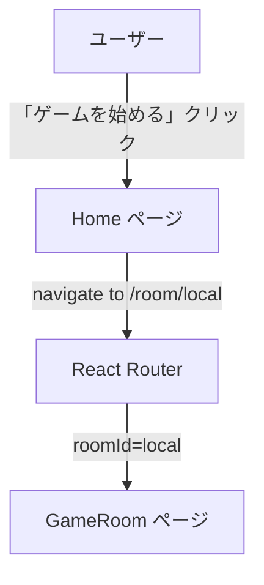
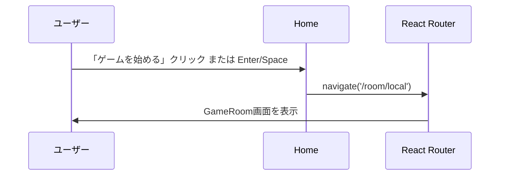

# Design Document: title-page

## Overview

タイトルページは、アナーキーオセロのランディング画面である。ゲームタイトル・コンセプト・アナーキーモードの説明を提示し、単一の「ゲームを始める」ボタンでローカルプレイへ直接遷移させる。

**Purpose**: ゲームの起点として、ユーザーがタイトルとコンセプトを把握し、すぐにゲームを開始できる画面を提供する。

**Users**: ゲームプレイヤー（子供を含む）がゲーム開始前にこの画面を利用する。

**Impact**: 既存の `Home.tsx` からルーム作成・ルーム参加UIを削除し、シンプルなゲーム開始画面へ置き換える。

### Goals
- ゲームタイトルとコンセプトを一目で把握できる画面を提供する
- 単一ボタンで `/room/local` へ遷移し、ローカルプレイを即座に開始できる
- 子供を含むすべてのユーザーがキーボード・スクリーンリーダーで操作できる

### Non-Goals
- ルーム作成・ルーム参加UI（削除対象）
- WebSocketによるリアルタイム対戦への対応（将来フェーズ）
- ユーザー認証・プロフィール機能

## Requirements Traceability

| Requirement | Summary | Components | Interfaces | Flows |
|-------------|---------|------------|------------|-------|
| 1.1 | タイトル「アナーキーオセロ」をヘッダーに表示 | `Home` | — | — |
| 1.2 | キャッチコピーをタイトル下に表示 | `Home` | — | — |
| 1.3 | アナーキーモード説明文を表示 | `Home` | — | — |
| 1.4 | タイトルをレスポンシブに大きく表示 | `Home` | — | — |
| 2.1 | ボタンクリックで `/room/local` へ遷移 | `Home` | `HomeProps` | ゲーム開始フロー |
| 2.2 | 「ゲームを始める」ボタンを1つだけ中央に表示 | `Home` | — | — |
| 2.3 | ルーム作成・参加UIを表示しない | `Home` | — | — |
| 2.4 | キーボード（Enter/Space）でゲーム開始 | `Home` | — | ゲーム開始フロー |
| 3.1 | ボタンに `role="button"`, `tabIndex={0}`, `aria-label` を設定 | `Home` | — | — |
| 3.2 | ボタンのタッチターゲットを最低44×44pxとする | `Home` | — | — |
| 3.3 | フォーカス時に `focus:outline-2 focus:outline-yellow-400` を表示 | `Home` | — | — |
| 4.1 | グラデーション背景 `from-blue-50 to-indigo-100` を使用 | `Home` | — | — |
| 4.2 | ダークモード対応カラーパレットを適用 | `Home` | — | — |
| 4.3 | ページをビューポート中央に縦横センタリング | `Home` | — | — |
| 4.4 | フッターに補足テキストを表示 | `Home` | — | — |

## Architecture

### Existing Architecture Analysis

既存の `Home.tsx` は以下の構造を持つ:
- `useState` で `roomId` を管理（削除対象）
- `handleCreateRoom`: ランダムIDを生成して `/room/{id}` へ遷移（削除対象）
- `handleJoinRoom`: フォーム送信で `/room/{roomId}` へ遷移（削除対象）
- グラデーション背景・タイトル・キャッチコピー・フッター（保持・拡充対象）

ルーティングは `App.tsx` の `/room/:roomId` ルートで `roomId="local"` として到達可能。App.tsx の変更は不要（詳細は `research.md` 参照）。

### Architecture Pattern & Boundary Map



**Architecture Integration**:
- 選択パターン: プレゼンテーション層のみの改修（ロジック層変更なし）
- 既存パターン維持: `useNavigate` によるクライアントサイドルーティング、Tailwind CSS によるスタイリング、ダークモード対応クラス
- 新規コンポーネント: なし（`Home.tsx` の直接改修）

### Technology Stack

| Layer | Choice / Version | Role in Feature | Notes |
|-------|------------------|-----------------|-------|
| Frontend | React 19 + TypeScript | UIレンダリング | 既存スタック |
| Routing | React Router v7 | `/room/local` へのナビゲーション | `useNavigate` を利用 |
| Styling | Tailwind CSS v4 | レスポンシブ・ダークモード対応 | 既存クラスを活用 |

## System Flows



## Components and Interfaces

| Component | Domain/Layer | Intent | Req Coverage | Key Dependencies | Contracts |
|-----------|--------------|--------|--------------|-----------------|-----------|
| `Home` | pages / UI | タイトル表示とゲーム開始ナビゲーション | 1.1–1.4, 2.1–2.4, 3.1–3.3, 4.1–4.4 | React Router `useNavigate` (P0) | State |

### pages

#### Home

| Field | Detail |
|-------|--------|
| Intent | ゲームタイトル・コンセプトを表示し、ローカルプレイへ遷移させるランディングページ |
| Requirements | 1.1, 1.2, 1.3, 1.4, 2.1, 2.2, 2.3, 2.4, 3.1, 3.2, 3.3, 4.1, 4.2, 4.3, 4.4 |

**Responsibilities & Constraints**
- タイトル・キャッチコピー・アナーキーモード説明文・「ゲームを始める」ボタン・フッターをレンダリングする
- `useState` は不使用（副作用なしの純粋プレゼンテーション層）
- ルーム作成・ルーム参加のUI要素を一切含まない

**Dependencies**
- Outbound: `useNavigate`（React Router v7） — `/room/local` へのナビゲーション（P0）

**Contracts**: State [x]

##### State Management
- State model: 状態なし（`useState` 不使用）
- 副作用: `useNavigate` によるルーター操作のみ
- Concurrency strategy: 該当なし

**Implementation Notes**
- Integration: `navigate('/room/local')` を「ゲームを始める」ボタンの `onClick` と `onKeyDown`（Enter/Space）ハンドラーに設定する
- Validation: ボタンクリック時のバリデーション不要（入力フォームなし）
- Risks: 将来的に `/room/local` がリアルタイム対戦ルートと競合する可能性がある。その場合は `roomId === "local"` をローカルモードとして特別扱いする実装が必要（`research.md` 参照）

##### Props Interface
```typescript
// Home はページコンポーネントのため props なし（React Router が直接マウント）
// ページ内部の型定義

interface HomeHandlers {
  handleStartGame: () => void;
  handleKeyDown: (e: React.KeyboardEvent) => void;
}
```

## Error Handling

### Error Strategy
本コンポーネントはナビゲーションのみを行う純粋なUIページであり、エラー境界は不要。

### Error Categories and Responses
- **ナビゲーション失敗**: React Router の `navigate` は通常失敗しない。`/room/local` ルートが存在しない場合は React Router のデフォルト（404相当）で処理される

## Testing Strategy

### Unit Tests
- タイトル「アナーキーオセロ」が `h1` で表示される
- キャッチコピーが表示される
- アナーキーモード説明文が表示される
- フッターテキストが表示される

### Integration Tests
- 「ゲームを始める」ボタンクリックで `navigate('/room/local')` が呼ばれる
- Enter キー押下でゲームが開始される（`navigate` が呼ばれる）
- Space キー押下でゲームが開始される（`navigate` が呼ばれる）

### Accessibility Tests
- ボタンに `role="button"` が設定されている
- ボタンに `tabIndex={0}` が設定されている
- ボタンに `aria-label` が設定されている
- ボタンの最小サイズが44×44pxである（Tailwind クラス確認）
- フォーカス時に `focus:outline-2 focus:outline-yellow-400` が適用されている

## Supporting References
- `research.md` — 既存コード分析、ルーティング設計の判断根拠
- `frontend/src/pages/Home.tsx` — 改修前の既存実装
- `frontend/src/App.tsx` — ルーティング設定（変更不要と確認済み）
